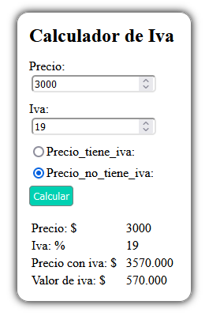

# Calculadora de IVA

Este repositorio contiene una _calculadora de IVA_ desarrollada en **JavaScript**, la cual puedes incorporar en un tus proyectos o páginas web **HTML** (2023).



## Instalación 

Sigue los siguientes pasos para clonar la calculadora:
1. Clona el repositorio:
    ```bash
    git clone https://github.com/Jhoan5/Calculadora_Iva.git
    ```
2. El código de la calculadora esta en el archivo `calculadora.js` y es carga a travez de un elemento **HTML** que esta dentro del archivo `index.html`
    ` <div id="calculadora"></div> `

## Ver
[Ver Calculadora en linea](https://jhoan5.github.io/Calculadora_Iva/)

> Este repositorio no permite contribuciones, solo lectura
